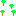
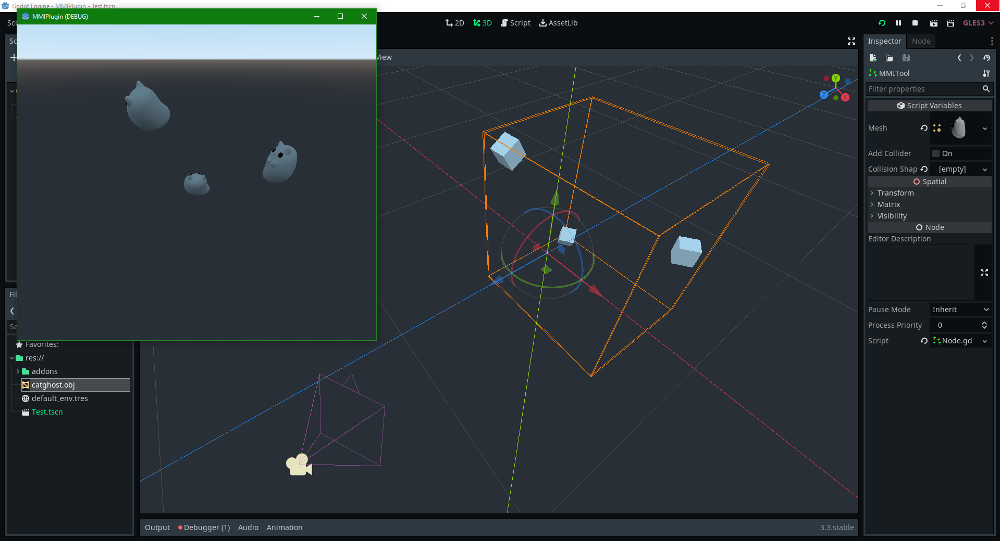

# MMITool

A plugin for Gotod (3.3) that simplifies working with MultimeshInstances.
If you have a lot of repeating models in a 3D scene, you should optimize iit by using a MultiMesh. Godot's editor doesn't make that easy, and you have to place your meshes by code.

With this tool, you can place everything visually and not have to worry about performance hits.

Usage: 
- Download repo and extract the addons folder (or use the Assetlib)
- Activate plugin
- Add a MMITool node to your scene
- Add anything that has a 3D position (e.g. Spatial) as children
- Set your mesh
- (Optional: set a collision shape, or just let it autogenerate for you)

If you want to bake lighting, add the actual model as children, it will run slow in your editor but will work fine once exported.

[cat ghost](https://sketchfab.com/3d-models/cute-spooky-cat-563ee36ca4904008a55ff4deb4f48209)